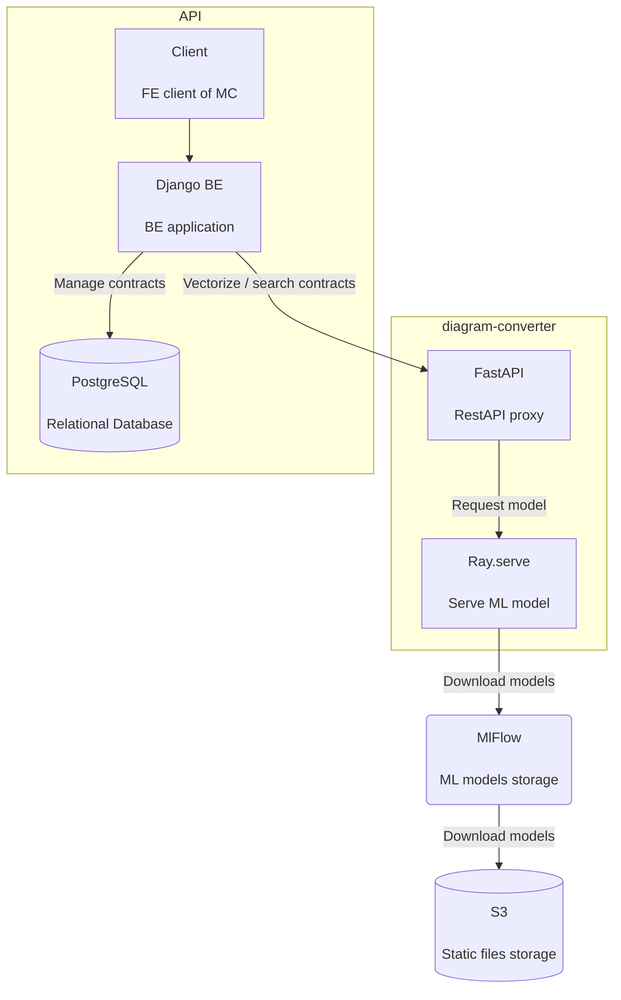
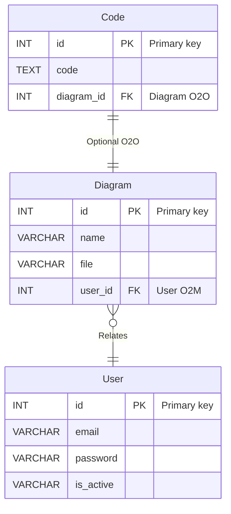
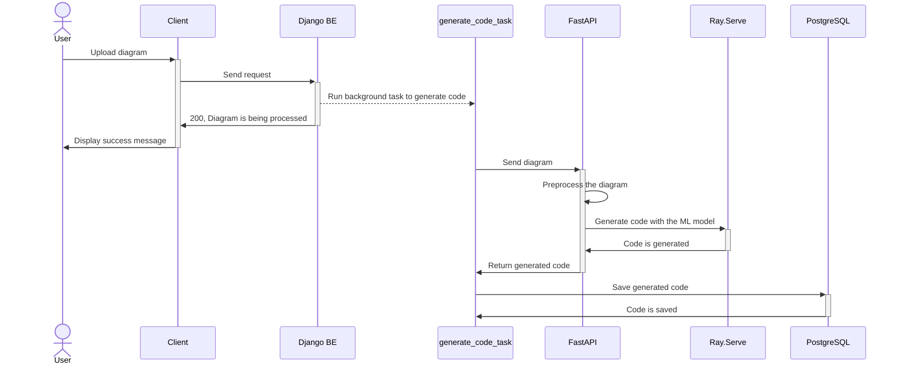

# Diagram Converter

Converter that transforms C4 PUML text
into Python code should be implemented. It'll be done as its own service.

## Containers

Below you may see the container diagram of the converter.

We use [ray.serve](https://docs.ray.io/en/latest/serve/index.html) to run the models and
experiments in production.

The models and experiments are stored in [mlflow](https://www.mlflow.org).

## Entity Relation

Below is the entity relation diagram of DB tables required for the task solution.

## Sequence

In the sequence diagram below you may see how user interacts with the ML converter.

## Problems & Troubleshooting

### Database Storage

As we know the generated from C4 diagram project can be "Big", e.g. contain a lot of files with
millions of rows. Keeping it all in the database is effective only if we generate one-file project.

Later, we should research a way to store the generated project in S3 and keep only links on the files
in the database.

### Code is generated slowly

There are several tactics to overcome slow generation.

First of all, we must (of course) generate the code in the background. We can notify users about
generation status using websockets.

We should monitor the execution of models. If we don't have enough entrypoints, we should open
more `ray.serve` nodes (it works with kubernetes). Otherwise, we should use more powerful
server instances with GPU support.
