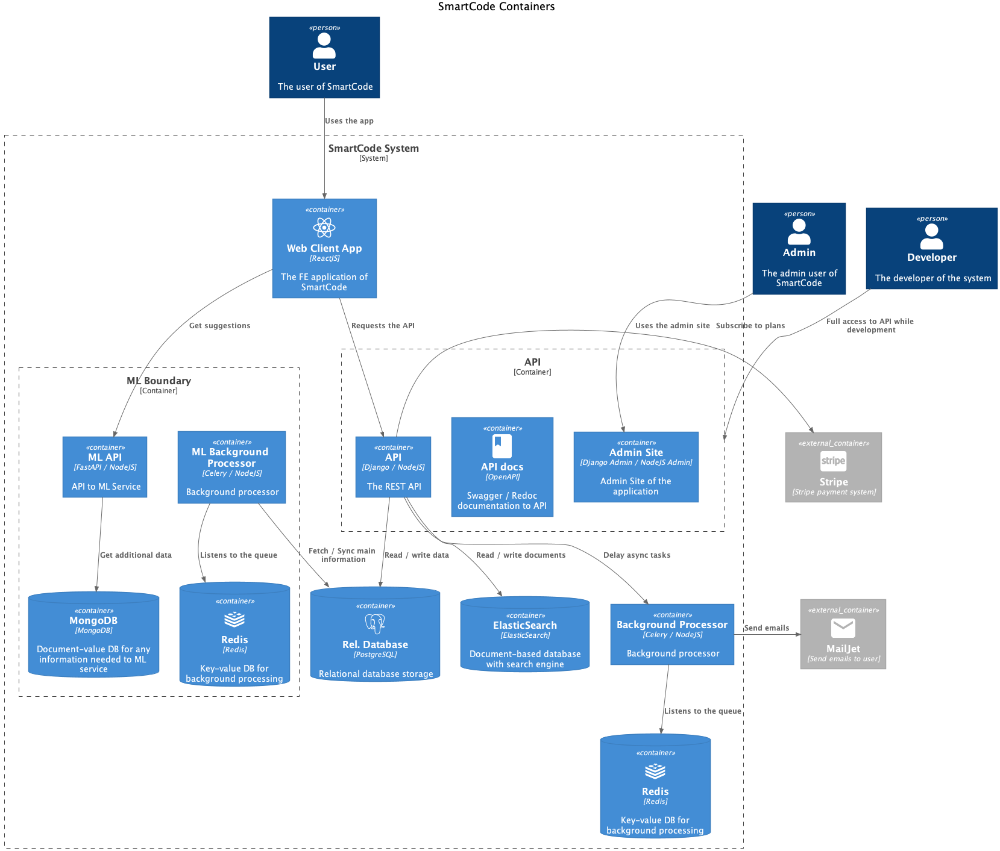

# Smart Code

Practical meterial to the first lecture of COAX Software Python Bootcamp.

## Project description

Github recently announced Copilot app. We want to build similar app but that builds code from C4 architecture.
The app is named SmartCode.

User can:

* Sign up / Sign in (2FA with Authenticator app);
* Manage profile;
* Add payment cards. Subscribe to plans;
* Get project structure suggestions;
* Generate project;
* Search projects.

Admin can:

* Manage data via django admin panel

## How to use this repo

This repository contains examples of all levels of [C4 model](https://c4model.com/) using PlantUML. The built architecture is build based on the project description above.

You can navigate by the files in the repo.

### System. The First Level

PUML diagram available by this [link](system.wsd).

### Containers. The Second Level

PUML diagram available by this [link](containers.wsd).

### Components. The Third Level

#### Authentication

PUML diagram available by this [link](components/authentication.wsd).

